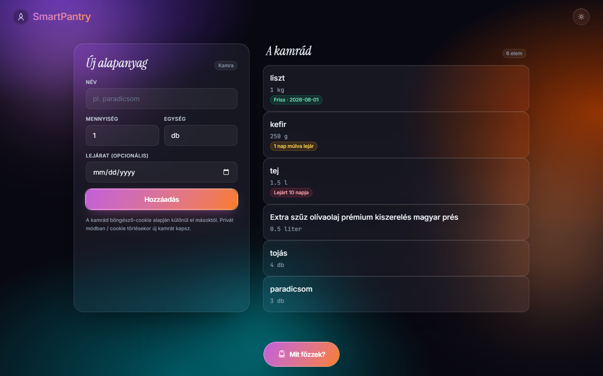
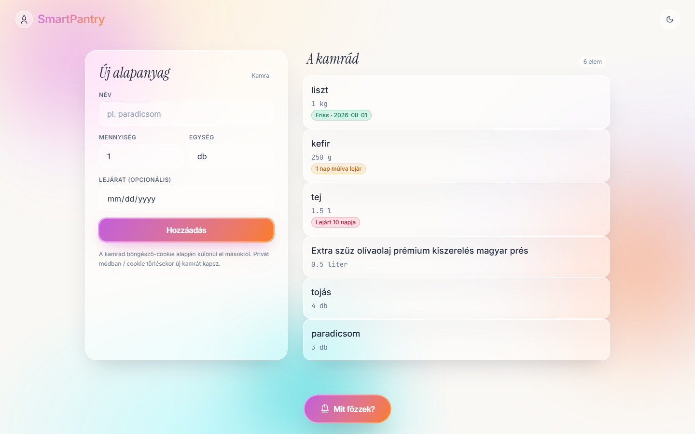
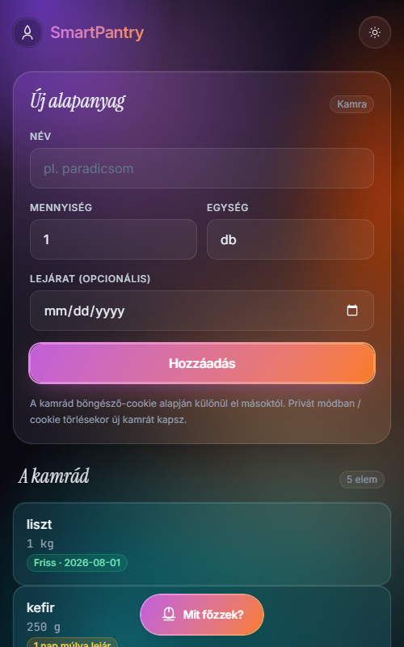
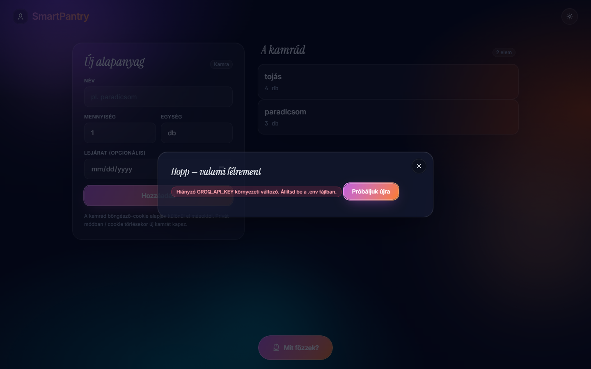

# SmartPantry

> **AI-powered pantry & recipe assistant** — F# / WebSharper / SQLite / Tailwind / Groq

[](https://github.com/justdawee/HHC62Y_ProjectOmega/actions/workflows/docker-build.yml)

SmartPantry helps you stop throwing food away. Track what's in your pantry,
flag what's about to expire, and let an LLM (Groq + Llama 3.3 70B) suggest a
quick recipe from the ingredients you actually have.



## Why this exists

Households waste a huge amount of food simply because nobody thinks to use up
the carrot, the half tin of tomatoes, and the eggs that are about to turn.
SmartPantry fixes the “what should I cook with this stuff?” friction in two
moves:

1. **Track the pantry** — name, quantity, unit, and (optionally) expiry date,
   with a glanceable colour-coded badge so the about-to-expire stuff jumps
   out at you.
2. **Press one button** → the server bundles your inventory into a Hungarian
   chef-prompt, ships it to Groq's free Llama-3.3-70B endpoint in JSON mode,
   and returns a structured recipe (title, prep time, numbered steps, tags)
   that renders into a neat modal.

It's a 1-page web app that runs in a single Docker container and remembers
your pantry per browser via an anonymous `sp_uid` cookie — **no signup, no
password, no account**.

## Tech stack

| Layer       | Choice                                                                 |
|-------------|------------------------------------------------------------------------|
| Backend     | F# (.NET 10) on **WebSharper.AspNetCore** with `[<Rpc>]` async methods |
| Frontend    | **WebSharper.UI** templating, reactive `Var` / `View` / `ListModel`    |
| Database    | **SQLite** + Dapper, single file on a mounted volume                   |
| Styling     | **Tailwind CSS** built at build time via MSBuild target                |
| AI          | **Groq** chat completions (Llama 3.3 70B) with JSON mode               |
| Bundling    | esbuild (WebSharper Release) → single `wwwroot/Scripts/all.js`         |
| Container   | Multi-stage Dockerfile (Node → SDK → ASP.NET runtime, non-root user)   |
| CI/CD       | GitHub Actions → `ghcr.io/justdawee/hhc62y_projectomega`               |

```
┌────────────────┐  HTTP/JSON-RPC  ┌────────────────────┐
│  Browser (UI)  │  ───────────►   │  WebSharper Server │
│  • Tailwind    │                 │  • Sitelet + Rpc   │
│  • Reactive    │                 │  • cookie auth     │
└────────────────┘                 └────────┬───────────┘
                                            │
                              ┌─────────────┼─────────────┐
                              ▼             ▼             ▼
                     ┌────────────┐  ┌────────────┐  ┌────────────┐
                     │  SQLite    │  │  Dapper    │  │ Groq LLM   │
                     │  /data/.db │  │  + Option  │  │  (HTTPS)   │
                     │            │  │  handlers  │  │            │
                     └────────────┘  └────────────┘  └────────────┘
```

## Screenshots

| Dark mode (desktop)                                          | Light mode (desktop)                              |
|--------------------------------------------------------------|---------------------------------------------------|
|         |           |

| Mobile (375 px)                              | Recipe modal (error state)                                  |
|----------------------------------------------|-------------------------------------------------------------|
|  |          |

## Quick start (Docker)

You need: **Docker** ≥ 24, **a Groq API key** (free at
[console.groq.com](https://console.groq.com/keys)).

```bash
git clone https://github.com/justdawee/HHC62Y_ProjectOmega.git
cd HHC62Y_ProjectOmega

# Drop your Groq key in the env file
cp .env.example .env
$EDITOR .env       # set GROQ_API_KEY=gsk_...

# Build + run (image is built locally on first run)
docker compose up -d

open http://localhost:8080
```

The pantry is persisted in `./data/smartpantry.db` (mounted as a volume).
Stop the container with `docker compose down`; data survives.

### Pulling the prebuilt image (skip the build)

Once the GitHub Actions workflow has published an image to ghcr.io:

```bash
docker compose pull          # grabs latest from ghcr
docker compose up -d
```

## Local development (no Docker)

```bash
# Install Tailwind + .NET dependencies
cd SmartPantry
npm ci
dotnet restore

# Run dev (serves on http://localhost:5000)
dotnet run -c Release

# Or build + run with the same dotnet workflow
dotnet build -c Release
GROQ_API_KEY=gsk_... ASPNETCORE_ENVIRONMENT=Production \
  dotnet run -c Release --no-build
```

> **Note:** `Debug` mode is supported but unbundled — you may hit a
> `Cannot access 'Elt' before initialization` TDZ error from a circular
> import in WebSharper's dev-mode ES module loader. Use `Release` mode
> for any browser testing.

## Environment variables

| Var                       | Required | Default                                  | Description                                            |
|---------------------------|----------|------------------------------------------|--------------------------------------------------------|
| `GROQ_API_KEY`            | yes      | _none_                                   | Groq Console API token. Without it, recipe gen errors. |
| `DB_PATH`                 | no       | `./smartpantry.db` (next to the binary)  | SQLite file location. In Docker we set `/data/...`.    |
| `ASPNETCORE_URLS`         | no       | `http://+:5000` (dev) / `:8080` (Docker) | Listen address.                                        |
| `ASPNETCORE_ENVIRONMENT`  | no       | `Production` (Docker) / `Development`    | Standard ASP.NET Core knob.                            |

Secrets never enter the repo — `.env` is `.gitignore`d. Only `.env.example`
is committed.

## Project layout

```
SmartPantry/
├── Domain.fs            F# records (PantryItem, Recipe, RecipeStep, …)
├── Database.fs          Dapper + SQLite + Option<'T> type handlers
├── LlmClient.fs         Groq HTTP client, prompt builder, JSON parsing
├── Remoting.fs          [<Rpc>] surface + cookie-derived UserContext
├── Startup.fs           ASP.NET host, sp_uid cookie middleware, DI
├── Site.fs              Single-page Sitelet (server-side shell)
├── Client.fs            [<JavaScript>] reactive UI (ListModel, Vars, modal state)
├── Main.html            Tailwind layout + ws-template sub-templates
├── styles/input.css     Glassmorphism components (mesh-bg, glass, cta-glow, …)
├── tailwind.config.js   Custom keyframes, fonts, dark mode
├── Dockerfile           3-stage build (node → sdk → aspnet runtime)
├── package.json         tailwindcss, esbuild, plugins
└── wwwroot/             Static assets (favicon, generated CSS/JS)

.github/workflows/
└── docker-build.yml     CI → ghcr.io image push

docker-compose.yml       Runtime composition + /data volume
.env.example             Env template
screenshots/             README assets
```

## Architecture notes

### Anonymous identity

Every visitor gets a `sp_uid` cookie (HttpOnly, SameSite=Lax, 1 year TTL,
random GUID). All RPC handlers read it from `HttpContext.Request.Cookies`
inside `UserContext.currentUserId()` — the client never sends a UserId
parameter, so a forged client cannot read someone else's pantry.

Trade-off: clearing cookies / private mode = a fresh empty pantry. This is
deliberate for a no-signup MVP; an export/import button would be a good
follow-up.

### F# Option<'T> ↔ Dapper

Dapper does not natively understand `'T option`. We register a generic
`OptionHandler<'T>` for primitives and a dedicated `DateTimeOptionHandler`
that handles SQLite's TEXT-based DateTime storage (parsing ISO 8601 strings
back into `DateTime`). Records are tagged `[<CLIMutable>]` so Dapper can
materialize them via the parameterless ctor + property setters.

### Reactive UI gotcha

WebSharper templates lose their event handler bindings if you re-instantiate
the template inside `View.Map`. The fix used here is to instantiate each
sub-template once outside `View.Map`, then wrap that single `Doc` in
`Doc.EmbedView` so the same instance is mounted/unmounted as state toggles.
That's why the sticky CTA, modal shell, and empty state are all built up-front.

### LLM contract

The Groq prompt asks **strictly** for JSON in this shape:

```json
{
  "title": "...",
  "prepTimeMinutes": 25,
  "steps": [{ "stepNumber": 1, "instruction": "..." }],
  "tags": ["..."]
}
```

We send `response_format: { "type": "json_object" }` so Groq guarantees
parseable JSON. Failures (network, 4xx/5xx, JSON parse) flow back as
`Result<Recipe, string>` and surface as a friendly modal with a retry button.

## CI/CD

`.github/workflows/docker-build.yml` builds the Dockerfile on every push to
`main` (and on PRs, without the push) and tags the image with:

- `latest` (main only)
- `sha-<short>` (every commit)
- semver tags (when you push `v*` tags)

GHCR uses the built-in `GITHUB_TOKEN` — no PAT setup required. To consume
the image elsewhere just `docker pull ghcr.io/justdawee/hhc62y_projectomega`.

## Verification matrix

End-to-end tested in Chrome via the Chrome DevTools MCP:

- ✅ CRUD round-trip (add / delete / counter / persistence after restart)
- ✅ XSS attempt (`<script>alert('xss')</script>` stays escaped, no execution)
- ✅ Expiry badges (fresh / soon-with-pulse / expired) at boundary days
- ✅ Modal open / Esc / backdrop / X-close, retry button on error
- ✅ Dark ⇄ Light toggle, persisted in `localStorage`, 600 ms crossfade
- ✅ Responsive 320 / 375 / 1440 px (no overflow, layout reflows correctly)
- ✅ Performance trace: **LCP 69 ms · CLS 0.00 · TTFB 3 ms** on local Release build
- ✅ Anonymous user isolation (incognito tab gets a fresh pantry)
- ⚠️ Recipe loading + loaded states require a real `GROQ_API_KEY` to verify

## License

For educational use (HHC62Y · Project Omega). LICENSE file at repo root.
