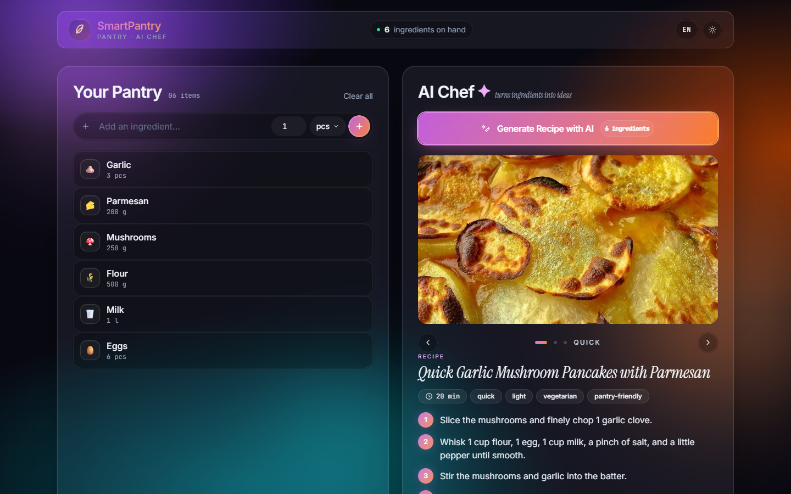
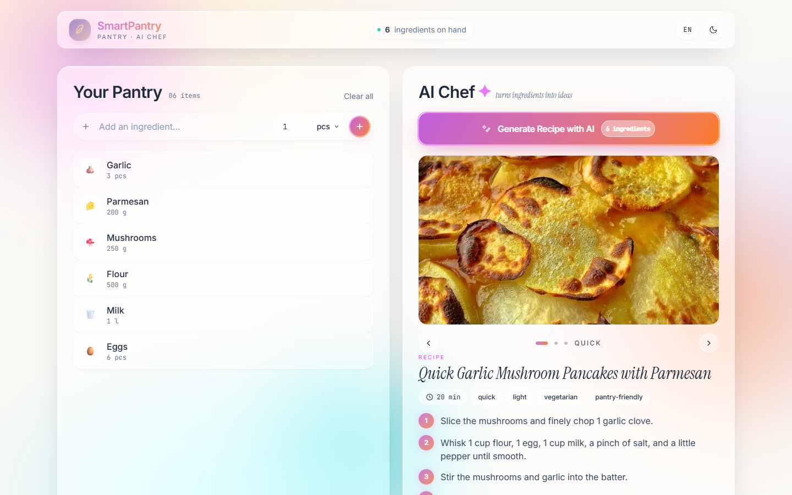
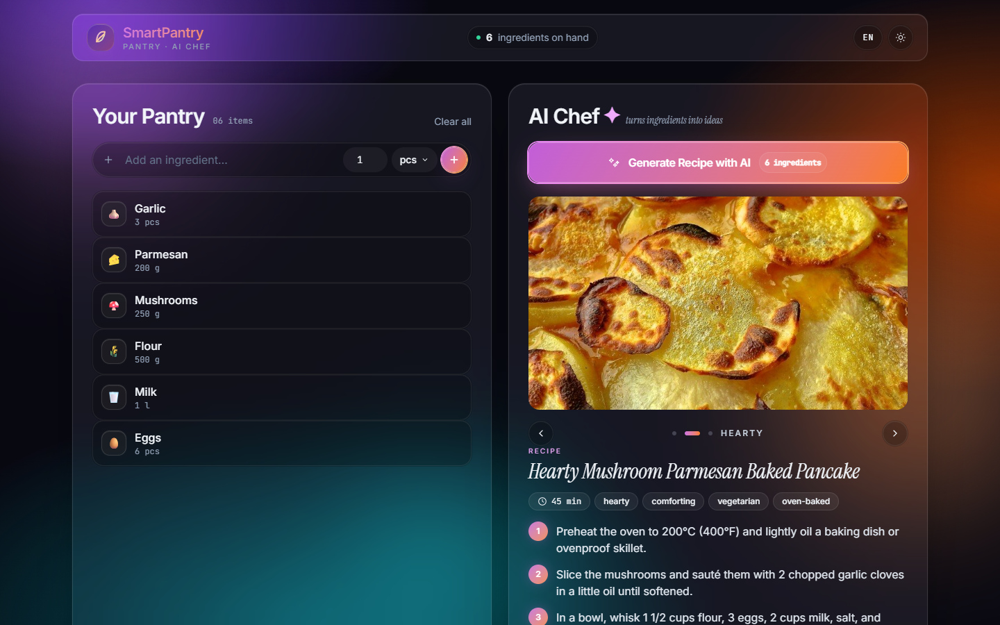
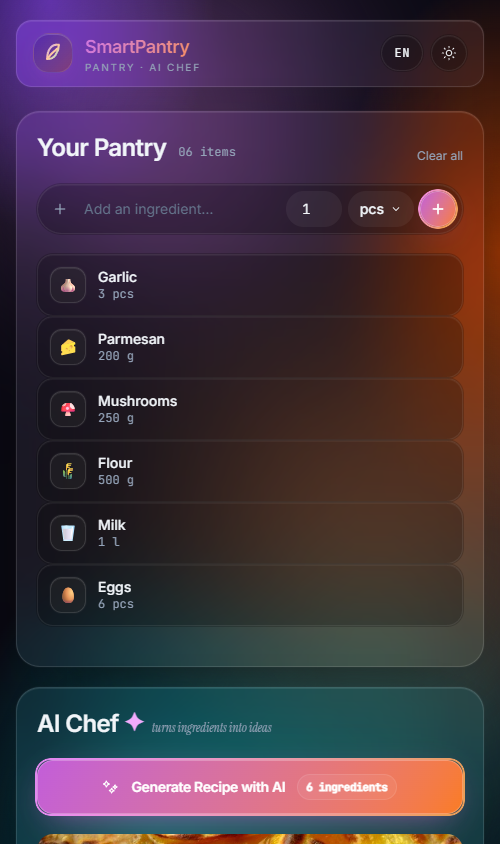
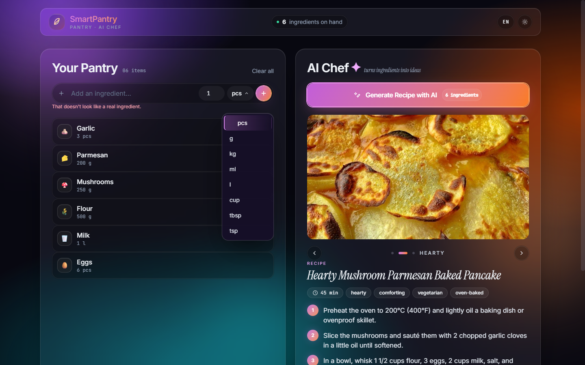
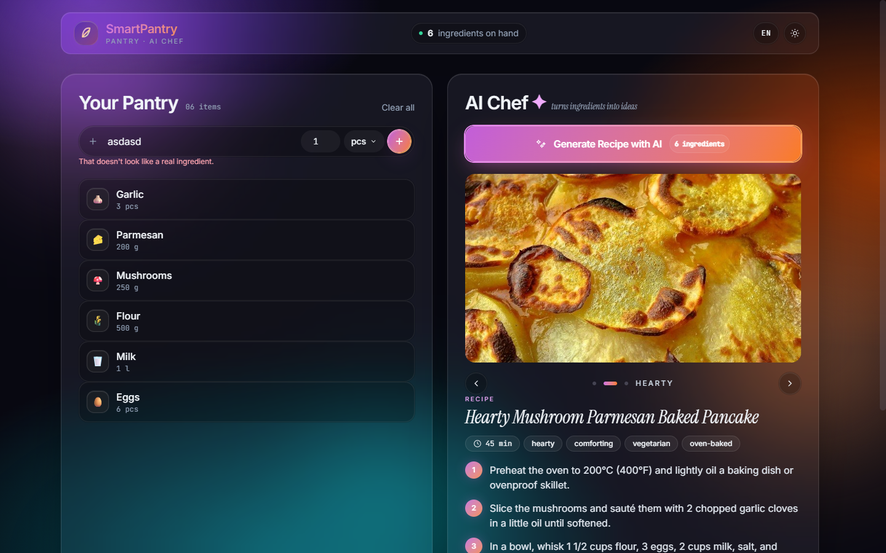

# SmartPantry

> **AI-powered pantry & recipe assistant** — F# / WebSharper / SQLite / Tailwind / OpenAI / TheMealDB

[](https://github.com/justdawee/HHC62Y_ProjectOmega/actions/workflows/docker-build.yml)

SmartPantry helps you stop throwing food away. Track what's in your pantry,
flag what's about to expire, and let OpenAI's `gpt-5.4-mini` propose
**three distinct recipe variations** (quick / hearty / creative) from the
ingredients you actually have on hand — each with a real food photo
sourced from [TheMealDB](https://www.themealdb.com/).



## Highlights

- **Bilingual UI (EN ⇄ HU)** — one-tap toggle in the header. The chosen
  language flows all the way down to the LLM prompt, so generated recipe
  copy comes back in your language.
- **Three recipe alternatives per generation** — Quick / Hearty / Creative.
  Browse them with arrow + dot slider, no extra API calls.
- **Real recipe imagery** — TheMealDB filters by your pantry ingredients
  to harvest a pool of real-world recipes; titles are fed to the LLM as
  inspiration; each generated variant gets a matching photo via a
  five-tier fallback chain. A procedural gradient + emoji always renders
  underneath so the card never looks broken.
- **Cheap LLM by default** — `gpt-5.4-mini` (~$0.75 input / $4.50 output
  per 1M tokens). Override with `OPENAI_MODEL` env var.
- **Three-tier safeguard against token waste**:
  - Client validation rejects garbage (`asdasd`, profanity, non-foods)
    before it ever hits the network.
  - Server gate refuses to call OpenAI when nothing in the pantry looks
    like real food.
  - Empty-result placeholder when the model parses but yields nothing.
- **Smart autocomplete** — 70+ ingredient catalog (English + Hungarian
  names) with default unit + emoji. Picking a suggestion auto-fills both
  the name AND the matching unit (`Milk` → `l`, `Tomato` → `pcs`).
- **Custom UI dropdown** for units (no native browser select), with
  reliable click-outside dismiss and full keyboard navigation.
- **Anonymous per-browser pantry** — `sp_uid` HttpOnly cookie, no signup
  / password / account.
- **Polished glassmorphism** with mesh gradient background, drifting
  orbs, animated CTA glow, slide-in step animations, expiry badges that
  pulse when items are close to going off.
- **Browser title localised** to the chosen language; favicon matches
  the gradient leaf in the header logo.

## Screenshots

| Desktop · dark                                            | Desktop · light                                            |
|-----------------------------------------------------------|------------------------------------------------------------|
|            |           |

| Recipe slider · second variant                            | Mobile (390 px)                                           |
|-----------------------------------------------------------|------------------------------------------------------------|
|         |                 |

| Custom unit dropdown                                      | Validation safeguards                                     |
|-----------------------------------------------------------|------------------------------------------------------------|
|            |         |

## Why this exists

Households waste a huge amount of food simply because nobody thinks to use
up the carrot, the half tin of tomatoes, and the eggs that are about to
turn. SmartPantry fixes the "what should I cook with this stuff?"
friction in two moves:

1. **Track the pantry** — name, quantity, unit, optional expiry. A
   colour-coded badge highlights what's about to expire.
2. **Press one button** → server gathers real-world recipe inspiration
   from TheMealDB, hands it (plus your pantry) to OpenAI, then resolves
   a real photo for each generated variant. You get three recipes you
   can actually cook tonight.

It's a single-page web app that runs in one Docker container and remembers
your pantry per browser via an anonymous `sp_uid` cookie — **no signup, no
password, no account**.

## Tech stack

| Layer        | Choice                                                                 |
|--------------|------------------------------------------------------------------------|
| Backend      | F# (.NET 10) on **WebSharper.AspNetCore** with `[<Rpc>]` async methods |
| Frontend     | **WebSharper.UI** templating, reactive `Var` / `View` / `ListModel`    |
| Database     | **SQLite** + Dapper, single file on a mounted volume                   |
| Styling      | **Tailwind CSS** built at build time via MSBuild target                |
| AI           | **OpenAI** `gpt-5.4-mini` chat completions with JSON mode              |
| Recipe data  | **TheMealDB** v1 free public API (filter + search)                     |
| Bundling     | esbuild (WebSharper Release) → single `wwwroot/Scripts/all.js`         |
| Container    | Multi-stage Dockerfile (Node → SDK → ASP.NET runtime, non-root user)   |
| CI/CD        | GitHub Actions → `ghcr.io/justdawee/hhc62y_projectomega`               |

```
┌────────────────┐  HTTP/JSON-RPC  ┌────────────────────┐
│  Browser (UI)  │  ───────────►   │  WebSharper Server │
│  • Tailwind    │                 │  • Sitelet + Rpc   │
│  • Reactive    │                 │  • cookie auth     │
└────────────────┘                 └────────┬───────────┘
                                            │
                ┌───────────────┬───────────┼───────────┬─────────────┐
                ▼               ▼           ▼           ▼             ▼
         ┌────────────┐  ┌────────────┐  ┌────────────┐  ┌────────────┐
         │  SQLite    │  │  Dapper    │  │  OpenAI    │  │ TheMealDB  │
         │  /data/.db │  │  + Option  │  │  (HTTPS)   │  │  (HTTPS)   │
         │            │  │  handlers  │  │            │  │            │
         └────────────┘  └────────────┘  └────────────┘  └────────────┘
```

## Quick start

You need: **Docker** ≥ 24 (or **.NET 10** + **Node 20** for local dev),
plus an **OpenAI API key** (cheap, get one at
[platform.openai.com/api-keys](https://platform.openai.com/api-keys)).

### Option 1 — local runner script (no Docker)

```bash
git clone https://github.com/justdawee/HHC62Y_ProjectOmega.git
cd HHC62Y_ProjectOmega

cp .env.example .env
$EDITOR .env       # set OPENAI_API_KEY=sk-proj-...

# Windows: PowerShell or double-click run.bat
.\run.ps1
```

The runner reads `.env`, masks your key in the console echo, and starts
the app on http://localhost:5000.

### Option 2 — Docker

```bash
cp .env.example .env       # set OPENAI_API_KEY
docker compose up -d
open http://localhost:8080
```

The pantry is persisted in `./data/smartpantry.db` (mounted as a volume).
Stop the container with `docker compose down`; data survives.

### Pulling the prebuilt image

Once GitHub Actions has published an image:

```bash
docker compose pull
docker compose up -d
```

## Local development

```bash
cd SmartPantry
npm ci
dotnet restore

dotnet run -c Release
```

> **Note:** `Debug` mode is supported but unbundled — you may hit a
> `Cannot access 'Elt' before initialization` TDZ error from a circular
> import in WebSharper's dev-mode ES module loader. Use `Release` mode
> for any browser testing.

## Environment variables

| Var                       | Required | Default                     | Description                                                                |
|---------------------------|----------|-----------------------------|----------------------------------------------------------------------------|
| `OPENAI_API_KEY`          | yes      | _none_                      | OpenAI API key. Without it, recipe generation errors out gracefully.       |
| `OPENAI_MODEL`            | no       | `gpt-5.4-mini`              | Override the chat model. Bump up for more quality, down for cheaper calls. |
| `MEALDB_KEY`              | no       | `1` (free public test key)  | Upgrade with your supporter key from themealdb.com if you hit rate limits. |
| `DB_PATH`                 | no       | `./smartpantry.db`          | SQLite file location. Docker uses `/data/smartpantry.db`.                  |
| `ASPNETCORE_URLS`         | no       | `http://+:5000` / `:8080`   | Listen address.                                                            |
| `ASPNETCORE_ENVIRONMENT`  | no       | `Production` (Docker)       | Standard ASP.NET Core knob.                                                |

Secrets never enter the repo — `.env` is `.gitignore`d. Only `.env.example`
is committed.

## Project layout

```
SmartPantry/
├── Domain.fs            F# records (PantryItem, Recipe, RecipeStep, RecipeBundle)
├── Strings.fs           Bilingual UI string table (en + hu)
├── Catalog.fs           70+ ingredient lookup with default unit + emoji
├── Validation.fs        Heuristic guards: garbage / profanity / non-food
├── Database.fs          Dapper + SQLite + Option<'T> type handlers
├── MealDbClient.fs      TheMealDB filter + search wrapper
├── LlmClient.fs         OpenAI Chat Completions, prompt + JSON parsing
├── Remoting.fs          [<Rpc>] surface + cookie-derived UserContext
├── Startup.fs           ASP.NET host, sp_uid cookie middleware, DI
├── Site.fs              Single-page Sitelet (server-side shell)
├── Client.fs            [<JavaScript>] reactive UI (ListModel, Vars, modal state)
├── Main.html            Tailwind layout + ws-template sub-templates
├── styles/input.css     Glassmorphism components (mesh-bg, glass, cta-glow, …)
├── tailwind.config.js   Custom keyframes, fonts, dark mode, plugin strategy
├── Dockerfile           3-stage build (node → sdk → aspnet runtime)
├── package.json         tailwindcss, esbuild, plugins
└── wwwroot/             Static assets (favicon, generated CSS/JS)

run.ps1, run.bat        Local runner — loads .env, launches dotnet
docker-compose.yml      Runtime composition + /data volume
.env.example            Env template
.github/workflows/      GitHub Actions CI -> ghcr.io
screenshots/            README assets
```

## Architecture notes

### Anonymous identity

Every visitor gets a `sp_uid` cookie (HttpOnly, SameSite=Lax, 1 year TTL,
random GUID). All RPC handlers read it from `HttpContext.Request.Cookies`
inside `UserContext.currentUserId()` — the client never sends a UserId
parameter, so a forged client cannot read someone else's pantry.

Trade-off: clearing cookies / private mode = a fresh empty pantry. This
is deliberate for a no-signup MVP.

### Recipe generation pipeline

```
User pantry  ──►  Catalog → English names                     (1)
                       │
                       ▼
              TheMealDB filter.php (parallel per ingredient)   (2)
                       │
                       ▼
              5-8 inspiration titles + photos
                       │
                       ▼
   ─────────► OpenAI Chat Completions w/ JSON mode             (3)
   │           (lang-specific prompt + inspirations)
   │                   │
   │                   ▼
   │           3 distinct recipes (quick/hearty/creative)
   │                   │
   │                   ▼
   │     For each recipe:                                      (4)
   │       inspiration map → search.php(hint) → search.php(title)
   │       → filter.php(catalog ingredient) → inspirations[idx]
   │
   └─◄─ Recipe.ImageUrl set, RecipeBundle returned to client
```

Tier 5 (final fallback) deterministically picks from the
already-fetched inspirations by variant index, so every variant always
gets a food-themed image even when no specific match is found.

### Three-tier garbage / token-waste safeguard

1. **Client (`Validation.fs`)** rejects too-short input, repeated
   characters (`asdasd`, `aaaa`), digits-only names, profanity (small
   EN+HU bank), and obvious non-foods (small EN+HU bank). Errors render
   inline with localised messages.
2. **Server (`Remoting.GenerateRecipes`)** filters the pantry through
   `Catalog ∪ Validation`. If nothing is plausible food, returns an
   error before ever calling OpenAI. Verified: a pantry of pure
   garbage triggers a 4 ms response with zero outbound API calls.
3. **LLM (`LlmClient`)** treats an empty `recipes[]` array as a soft
   error with a friendly retry message instead of a stack trace.

### F# Option<'T> ↔ Dapper

Dapper does not natively understand `'T option`. Custom
`OptionHandler<'T>` for primitives + a dedicated `DateTimeOptionHandler`
that handles SQLite's TEXT-based DateTime storage. Records are tagged
`[<CLIMutable>]` so Dapper can materialize them via the parameterless
ctor + property setters.

### WebSharper templating gotchas (battle-tested here)

- **Inline event handlers get stripped.** `` from the
  template won't fire; use `Doc.Element "img" [ on.load … ]` instead.
- **Re-instantiating sub-templates inside `View.Map` drops their event
  handlers.** Build sub-templates once outside the `View.Map`, then
  swap them in/out via `Doc.EmbedView`.
- **Multi-arg `JS.Inline` with curried F# functions emits TypeError.**
  Single-arg `JS.Inline` functions work; for two args, use two
  single-arg helpers.
- **F# records as RPC types need `[<JavaScript>]`** so they round-trip
  to the client without a wire-format mismatch.

### LLM contract

The OpenAI prompt asks **strictly** for JSON in this shape:

```json
{
  "recipes": [
    {
      "title": "Quick mushroom risotto",
      "prepTimeMinutes": 25,
      "steps": [{ "stepNumber": 1, "instruction": "…" }],
      "tags": ["quick","vegetarian"],
      "imagePromptHint": "creamy mushroom risotto on a white plate"
    }
  ]
}
```

The prompt opens AND closes with a target-language directive, gives a
target-language example title + step + tags, and forbids translating
foreign ingredient names back to their original language inside the
recipe text. `imagePromptHint` is always English so it can feed the
TheMealDB image search even when the recipe itself is Hungarian.

## CI/CD

`.github/workflows/docker-build.yml` builds the Dockerfile on every push
to `main` (and on PRs without the push) and tags the image with:

- `latest` (main only)
- `sha-<short>` (every commit)
- semver tags (when you push `v*` tags)

GHCR uses the built-in `GITHUB_TOKEN` — no PAT required. To consume
the image elsewhere just `docker pull
ghcr.io/justdawee/hhc62y_projectomega`.

## Verification matrix

End-to-end tested in Chrome via the Chrome DevTools MCP across multiple
iterations:

- ✅ CRUD round-trip + persistence after container restart
- ✅ XSS attempt (`<script>` tag) rendered as escaped text
- ✅ Validation: `asdasd` / `bicikli` / profanity all blocked at the
  client; pure garbage pantry blocked at the server (4 ms, zero
  OpenAI tokens spent)
- ✅ Expiry badges (fresh / soon-with-pulse / expired) at boundary days
- ✅ Recipe slider: arrow + dot navigation, smooth slide animation,
  every variant gets a real photo
- ✅ Custom unit dropdown: opens, closes on outside click, click on
  any option fires correctly even over hover-able pantry cards
- ✅ Autocomplete suggestions, auto-unit on exact-match name typing
- ✅ Dark ⇄ Light toggle, persisted in `localStorage`, smooth crossfade
- ✅ EN ⇄ HU toggle: header + pantry + AI chef + footer + LLM prompt
  all switch; toast prompts for reload to translate existing pantry
- ✅ Browser title syncs to the chosen language
- ✅ Responsive 320 / 375 / 390 / 1440 px (no overflow, layout reflows)
- ✅ Performance: **LCP < 100 ms** on local Release build, **CLS 0.00**
- ✅ Anonymous user isolation (incognito tab gets a fresh pantry)
- ✅ End-to-end OpenAI generation in ~3–9 s with 3 recipe variants

## Credits

Built with ♥ by [JustDawee](https://github.com/justdawee). Free public
recipe data from [TheMealDB](https://www.themealdb.com/). LLM by
[OpenAI](https://platform.openai.com/).

## License

For educational use (HHC62Y · Project Omega). LICENSE file at repo root.
